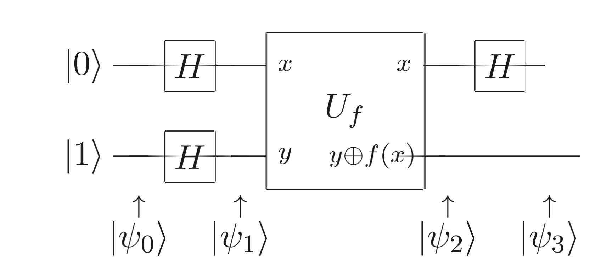

# Deutch's Algorithm

## Overview

This repository uses IBM's quantum composer and the Qiskit SDK to implement Deutch's algorithm, one of the first demonstrations that quantum computation could be faster than classical at solving certain problems. Here, I build and explain a quantum circuit that demonstrates this algorithm.

## The Circuit:

  

<i>Circuit implementing Deutch's algorithm from Nielsen and Chuangs 'Quantum Computation and Quantum Information'</i>

 

## The Algorithm:

Consider a case where we want to determine wether a function is constant or balanced. We have a binary function:

$$f: [0, 1] \to [0, 1]$$

Which takes an input of either 0 or 1 and returns either 0 or 1.

If this function were balanced, it would have as many outputs for 0 as it did for 1, and if it were constant it would either output only 0 or only 1. A classical computer would need two queries to this function to determine wether $f(0) = f(1)$ amd that the function is therefore constant, whilst a quantum computer would require a single query.

This is done by implementing a reversible oracle function - essentially a 'black-box' - which takes an input, performs a specific operation, and returns an output.

## Circuit Implementation:

We start in the state 

$$|\Psi\rangle = |00\rangle$$

apply a CNOT gate:

$$|\Psi_0\rangle = |01\rangle$$

and then a Hadamard gate:

$$|\Psi_1\rangle = |+-\rangle = \frac{1}{\sqrt{2}} (|0\rangle|-\rangle + |1\rangle|-\rangle)$$

Which is where we query our oracle, $U_f$. We find that this is in the form of a phase oracle with phase kickback:

$$U_f|x\rangle|-\rangle = (-1)^{f(x)}|x\rangle|-\rangle$$

So therefore:

$$|\Psi_2 = \frac{1}{\sqrt{2}}((-1)^{f(0)}|0\rangle|-\rangle + (-1)^{f(1)}|1\rangle|-\rangle)$$

We simplify this by factoring out and omitting our $|-\rangle$ state as it is not required form here on.

## Results:

We now consider our two cases: where $f(0) = f(1)$ or $f(0) \neq f(1)$.
